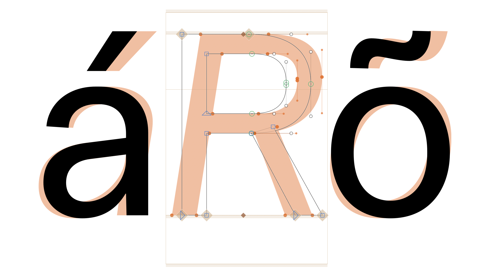
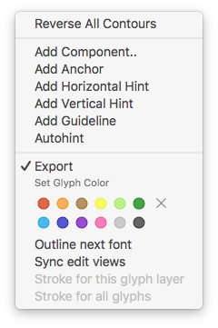

Show Next Font
==============
This plugin shows in a light orange colour the same glyph of another opened font. It could be useful for visual comparison of italics with normal styles,or different versions of the same font. 

### How to use:
Open two fonts and activate the plugin via **View>Show Next Font** menu item.
The ammount of masters of the fonts should be the same, in case of difference the plugin shows the first master only.

To sync edit view bwetween fonts, right-click when editing a glyph and choose 
"Sync edit views".

In edit view, under right-click menu for Sync edit views between fonts.

### Installation:
Download the plugin, open it and restart glyphs.
For better update handling install the script via the **Window > Plugin Manager** inside Glyphs App.

### Note:
This plugin was inspired by the Show Next Master plugin from Mark Frömberg (mirque.de).

### Donate:
If this plugin is helpful for you, maybe you can consider making a donation ;)

