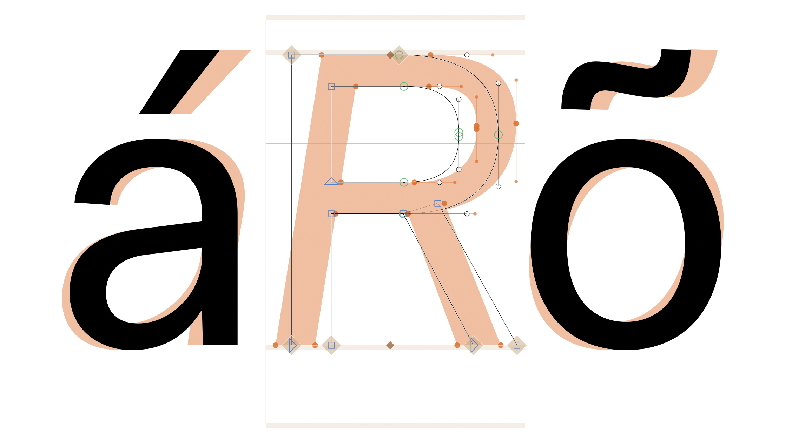
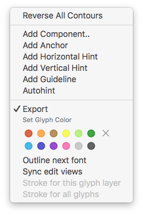

# Show Next Font

This plugin shows in a light orange colour the same glyph of another opened font. It can be useful for visual comparison of italics with normal styles,or different versions of the same font.



### How to use:

Open two Glyphs files and activate the plugin via **View>Show Next Font** menu item. If the amount of masters in the two files differs, only the first master of the next font is shown for any additional masters.

### Configuration

#### Glyphs 3

Under the contextual menu you can find menu items for:

- swap next font view between outline and fill mode.
- show/hide next font nodes and handles
- sync edit views across open fonts.



Additional settings can be adjusted via the **Macro Panel.** Upgrade to Glyphs 4 to get a UI for those preferences.

```py
Glyphs.defaults["comGuidoferreyraShowNextFontShowAnchors"] = False
Glyphs.defaults["comGuidoferreyraShowNextFontShowSidebearings"] = False
Glyphs.defaults["comGuidoferreyraShowNextFontMatchAngle"] = False
Glyphs.defaults["comGuidoferreyraShowNextFontCenter"] = False
```

#### Glyphs 4

View options can be set under **Glyphs > Settings... > Advanced > Show Next Font.**

- **Fill color:** Select the base color which is used for the filled glyph. Colors for the outlines, nodes, etc. are derived from it
- **Fill next font:** Whether to show a filled glyph or just the outlines
- **Show nodes:** Show the nodes and handles of the background glyph
- **Show anchors:** Show anchors from the background glyph
- **Show sidebearings:** Show the sidebearings of the background glyph as lines
- **Match italic angle:** Show the background glyph slanted with the current master’s italic angle
- **Center layer horizontally:** Show the background glyph centered instead of left-aligned

Under the contextual menu you can find a menu item for syncing the edit views across open fonts.

### Installation:

For better update handling install the plugin via the **Window > Plugin Manager** inside Glyphs App and restart the app.

### Note:

This plugin was inspired by the Show Next Master plugin from Mark Frömberg (markfromberg.com) and includes more recent contributions from @jenskutilek, @schriftgestalt, @mekkablue, @Mark2Mark

### Donate:

If this plugin is helpful for you, maybe you can consider making a donation ;)

[](https://www.paypal.com/cgi-bin/webscr?cmd=_donations&business=NXQFEWCXXJABE&lc=US&item_name=Github%20Donate&currency_code=USD&bn=PP%2dDonationsBF%3abtn_donate_LG%2egif%3aNonHosted)
